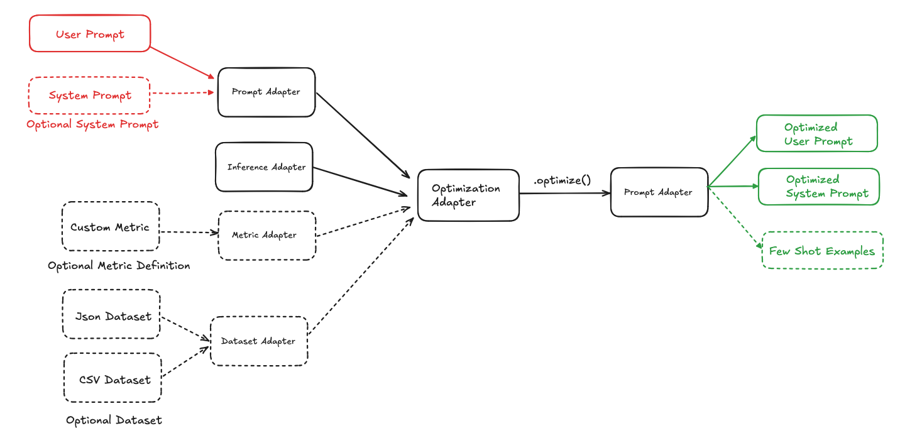

# Nova Prompt Optimizer

A Python SDK for optimizing prompts for Nova.

## 📚 Table of contents
* [Installation](#installation)
* [Pre-Requisites](#pre-requisites)
* [Quick Start: Facility Support Analyzer Dataset](#-quick-start)
* [Core Concepts](#core-concepts)
  * [Input Adapters](#input-adapters)
    * [1. Prompt Adapter](#1-prompt-adapter)
    * [2. Inference Adapter](#2-inference-adapter)
    * [3. Dataset Adapter](#3-dataset-adapter)
    * [4. Metric Adapter](#4-metric-adapter)
    * [5. Optimization Adapter](#5-optimization-adapter)
  * [Optimizers](#optimizers)
    * [NovaPromptOptimizer](#novapromptoptimizer)
  * [Evaluator](#evaluator)
* [Optimization Recommendations](#optimization-recommendations)
* [Preview Status](#-preview-status)
* [Acknowledgements](#acknowledgements)

## Installation

Install the library using
```sh
pip3 install nova-prompt-optimizer
```


## Pre-Requisites

#### Setup your AWS Access Keys:

To execute the SDK, you will need AWS credentials configured. Take a look at the [AWS CLI configuration documentation](https://docs.aws.amazon.com/cli/latest/userguide/cli-chap-configure.html#config-settings-and-precedence) for details on the various ways to configure credentials. 
An easy way to try out the SDK is to populate the following environment variables with your AWS API credentials. 
Take a look at this guide for [Authenticating with short-term credentials for the AWS CLI](https://docs.aws.amazon.com/cli/latest/userguide/cli-authentication-short-term.html)

```commandline
export AWS_ACCESS_KEY_ID="..."
export AWS_SECRET_ACCESS_KEY="..."
```

#### To enable Nova model access:
1. Go to the Amazon Bedrock Model Access page
2. Click "Manage model access"
3. Choose Amazon as provider and Nova models
4. Click "Request access"
5. Wait for approval (instant in most cases)


## 🏁 Quick Start
### Facility Support Analyzer Dataset
The Facility Support Analyzer dataset consists of emails that are to be classified based on category, urgency and sentiment.

Please see the [samples](samples/facility-support-analyzer/) folder for example notebooks of how to optimize a prompt in the scenario where a [user prompt template is to be optimized](samples/facility-support-analyzer/user_prompt_only) and the scenario where a [user and system prompt is to be optimized together](samples/facility-support-analyzer/system_and_user_prompt)


## Core Concepts

### Input Adapters
We break each component of Prompt Optimization into Adapters providing a modular approach to Prompt Optimization.



### 1. Prompt Adapter

**Responsibility:** Ability to load prompts from different formats and store them in the standardized format (JSON)


**Sample Prompt Adapter Initialization**

```python
from amzn_nova_prompt_optimizer.core.input_adapters.prompt_adapter import TextPromptAdapter

prompt_adapter = TextPromptAdapter()

prompt_adapter.set_system_prompt(file_path="prompt/sys_prompt.txt", variables={"foo"})

prompt_adapter.set_user_prompt(content="You are a .....", variables={"bar"})

prompt_adapter.adapt()
```

**Supported Prompt Adapters:** `TextPromptAdapter`

Learn More about the Prompt Adapter [here](docs/PromptAdapter.md)

### 2. Inference Adapter
**Responsibility:** Ability to call an inference backend for the models e.g. Bedrock, etc.

**Sample use of Inference Adapter**

```python
from amzn_nova_prompt_optimizer.core.inference.adapter import BedrockInferenceAdapter

inference_adapter = BedrockInferenceAdapter(region_name="us-east-1")
```

You can pass `rate_limit` into constructor of InferenceAdapter to limit the max TPS of bedrock call to avoid throttle. Default to 2 if not set.

```python
from amzn_nova_prompt_optimizer.core.inference.adapter import BedrockInferenceAdapter

inference_adapter = BedrockInferenceAdapter(region_name="us-east-1", rate_limit=10) # Max 10 TPS
```

**Supported Inference Adapters:** `BedrockInferenceAdapter`

**Core Functions**

Call the model using the parameters
```python
# Call the model with the passed parametrs
inference_output = inference_adapter.call_model(model_id: str, system_prompt: str, messages: List[Dict[str, str]], inf_config: Dict[str, Any])
```

The Inference Adapter accepts the `system_prompt` as a string.

The input to the model as a list of User/Assistant turns (messages). e.g. `[{"user": "foo"}, {"assistant": "bar"}, {"user": "What comes next?"}]`

### 3. Dataset Adapter

**Responsibility:** Ability to read/write datasets from different formats. Uses an intermediary standardized format when communicating with other adapters.
It can also read list of JSON object. It can also create Train/Test splits (with stratify capability if set).

**Requirements:** Currently, you can only provide a singleton set as output column.

**Sample Dataset Adapter Initialization**
```python
# Example Usage
from amzn_nova_prompt_optimizer.core.input_adapters.dataset_adapter import JSONDatasetAdapter

input_columns = {"input"}
output_columns = {"answer"}

dataset_adapter = JSONDatasetAdapter(input_columns, output_columns)

# Adapt
dataset_adapter.adapt(data_source="sample_data.jsonl")

# Split
train, test = dataset_adapter.split(0.5)
```

**Supported Dataset Adapters:** `JSONDatasetAdapter`, `CSVDatasetAdapter`

Learn More about the Dataset Adapter [here](docs/DatasetAdapter.md)

### 4. Metric Adapter
**Responsibility:** Ability to load custom metrics and apply them on inference output and ground truth

**Metric Adapter Class**
```python
class MetricAdapter():
    def apply(self, y_pred: Any, y_true: Any) -> float:
        pass

    def batch_apply(self, y_preds: List[Any], y_trues: List[Any]) -> float:
        pass
```

**Sample Custom Metric Adapter Initialization**
Let's create a Custom metric adapter that parses the inference output for the answer between `<answer> </answer>` tags and then performs an exact match metric.

```python
from amzn_nova_prompt_optimizer.core.input_adapters.metric_adapter import MetricAdapter
from typing import List, Any, Dict
import re
import json

class CustomMetric(MetricAdapter):
    def _parse_answer(self, model_output):
        # Parse Answer between tags
        match = re.search(r"<answer>(.*?)</answer>", model_output)
        if not match:
            return "Choice not found"
        return match.group(1).lower().strip()

    def _calculate_metrics(self, y_pred: Any, y_true: Any) -> Dict:
        # Peform Exact Match
        pred = self._parse_answer(y_pred)
        ground_truth = self._parse_answer(y_true)
        return int(pred == ground_truth)

    def apply(self, y_pred: Any, y_true: Any):
        # Apply to one row of the dataset
        return self._calculate_metrics(y_pred, y_true)

    def batch_apply(self, y_preds: List[Any], y_trues: List[Any]):
        # Apply to the whole dataset
        evals = []
        for y_pred, y_true in zip(y_preds, y_trues):
            evals.append(self.apply(y_pred, y_true))
        return sum(evals)/len(evals)

metric_adapter = CustomMetric()
```

**Core Functions**
Apply the metric on a prediction and ground_truth one row at a time
```python
y_pred = "The question asks ...... <answer>3</answer>"
y_true = "<answer>3</answer>"

# Apply the metric on a prediction and ground_truth
score = metric_adapter.apply(y_pred, y_true)

# score = 1
```

Apply the metric on a list of prediction and ground_truth i.e. for the dataset
```python
y_preds = ["The question asks ...... <answer>3</answer>", "The question asks ...... <answer>5</answer>"]
y_trues = ["<answer>3</answer>", "<answer>4</answer>"]

# Apply the metric on a list of prediction and ground_truth
aggregeate_score = metric_adapter.batch_apply(y_preds, y_trues)

# aggregeate_score = 0.5
```


### 5. Optimization Adapter
**Responsibility:** Load Optimizer, Prompt Adapter, and Optionally Dataset Adapter, Metric Adapter, and Inference Adapter. Perform Optimization and ability to create a Prompt Adapter with the Optimized Prompt.

Sample Optimization Initialization
```python
from amzn_nova_prompt_optimizer.core.optimizers import NovaPromptOptimizer

nova_prompt_optimizer = NovaPromptOptimizer(prompt_adapter=prompt_adapter, inference_adapter=inference_adapter, dataset_adapter=train_dataset_adapter, metric_adapter=metric_adapter)

optimized_prompt_adapter = nova_prompt_optimizer.optimize(mode="lite")
```

We can take a look more deeply into the optimizers in the next section.


## Optimizers

### NovaPromptOptimizer

NovaPromptOptimizer is a combination of Meta Prompting using the Nova Guide on prompting and DSPy's MIPROv2 Optimizer using Nova Prompting Tips. 
NovaPromptOptimizer first runs a meta prompter to identify system instructions and user template from the prompt adapter. 
Then MIPROv2 is run on top of this to optimize system instructions and identify few-shot samples that need to be added. 
The few shot samples are added as `converse` format so they are added as User/Assistant turns.

**Requirements:** NovaPromptOptimizer requires Prompt Adapter, Dataset Adapter, Metric Adapter and Inference Adapter.

**Optimization Example**
```python
from amzn_nova_prompt_optimizer.core.optimizers import NovaPromptOptimizer

nova_prompt_optimizer = NovaPromptOptimizer(prompt_adapter=prompt_adapter, inference_adapter=inference_adapter, dataset_adapter=train_dataset_adapter, metric_adapter=metric_adapter)

optimized_prompt_adapter = nova_prompt_optimizer.optimize(mode="lite")
```
NovaPromptOptimizer uses Premier for Meta Prompting and then uses MIPROv2 with 20 candidates and 50 trials with Premier as Prompting model and task model dependent on the mode it's set at.
You can specify enable_json_fallback=False to disable the behavior that MIPROv2 will [fallback to use JSONAdapter to parse LM model output](https://github.com/stanfordnlp/dspy/blob/main/dspy/adapters/chat_adapter.py#L44-L51). This will force MIPROv2 use structured output (pydantic model) to parse LM output.

You could also define a custom mode and pass your own parameter values to NovaPromptOptimizer

```python
from amzn_nova_prompt_optimizer.core.optimizers import NovaPromptOptimizer

nova_prompt_optimizer = NovaPromptOptimizer(prompt_adapter=prompt_adapter, inference_adapter=inference_adapter, dataset_adapter=train_dataset_adapter, metric_adapter=metric_adapter)

optimized_prompt_adapter = nova_prompt_optimizer.optimize(mode="custom", custom_params={"task_model_id": "us.amazon.nova-pro-v1:0",
    "num_candidates": 10,
    "num_trials": 15,
    "max_bootstrapped_demos": 5,
    "max_labeled_demos": 0
})
```

Learn More about the Optimizers [here](docs/Optimizers.md)

## Evaluator
The SDK also provides a way to baseline prompts and provide evaluation scores.
The evaluator has the `aggregate_score` and `scores` function.

**Initialization Example**
```python
from amzn_nova_prompt_optimizer.core.evaluation import Evaluator

evaluator = Evaluator(nova_mp_optimized_prompt_adapter, test_dataset_adapter, metric_adapter, inference_adapter)

nova_mp_score = evaluator.aggregate_score(model_id="us.amazon.nova-lite-v1:0")
```
**Core Functions**

Runs Batch evaluation on the dataset using the batch_apply function of the metric
```python
# Uses Batch Apply
aggregate_score = evaluator.aggregate_score(model_id)
```

Runs evaluation on the dataset a row at a time and returns the eval results as a whole.
```python
# Uses Apply metric. Returns a list of scores.
scores = evaluator.score(model_id)
```

Save the eval results.
```python
# Save the eval results
evaluator.save("eval_results.jsonl")
```


**Note: You may come across the below warning. This is when prompt variables are missing from the prompt, the inference runner under the evaluator appends them to the end of the prompt for continuity**
```python
WARNING amzn_nova_prompt_optimizer.core.inference: Warn: Prompt Variables not found in User Prompt, injecting them at the end of the prompt
```

## Optimization Recommendations
1. Provide representative real-world evaluation sets and split them into training and testing sets. Ensure dataset is balanced on output label when splitting train and test sets.
2. For evaluation sets, the ground truth column should be as close to the inference output as possible. e.g. If the inference output is {"answer": "POSITIVE"} ground truth should also be in the same format {"answer": "POSITIVE"}
3. For NovaPromptOptimizer, choose the mode (mode= "premier" | ""pro" | "lite" | "micro") based on your Nova Model of choice. By default, we use "pro".
4. The `apply` function of the evaluation metric should return a numerical value between 0 and 1 for NovaPromptOptimizer or MIPROv2.

## ⚠️ Preview Status

NovaPromptOptimizer is currently in public preview. During this period:
- SDK functionality might change as we support more use cases.
- We welcome feedback and contributions

## Acknowledgements
* Special acknowledgment to [DSPy](https://github.com/stanfordnlp/dspy) – your innovations continue to inspire us.
